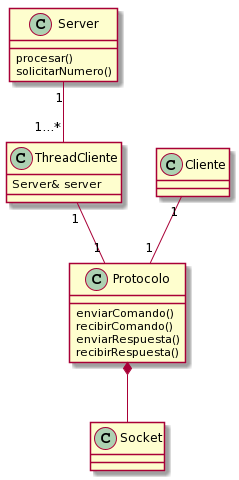

# Informe Trabajo Práctico 3

Nombre: Lautaro Gastón Fritz

Padrón: 102320

Enlace al repositorio de GitHub: https://github.com/lautarofritz/tp3

## Introducción

En el presente informe se detalla la resolución del Trabajo Práctico 3, el cual consistía en el desarrollo de un juego provisto por un servidor, que permita la conexión de múltiples clientes a la vez utilizando threads.

A continuación se detallan cuestiones tales como el diseño del programa y las decisiones detrás de él, y algunos de los problemas encontrados a lo largo del desarrollo.

## Diseño

A continuación se muestran dos diagramas con las clases que componen el modelo: el primero se centra en la creación y posterior terminación de los hilos, mientras que el segundo se enfoca en el juego en sí y en el envío y recepción de mensajes entre las partes.

Como se ve, la mayoría de las clases "pertenecen" al servidor, ya que la lógica detrás de él es más compleja que la de los clientes.

La clase Server se encarga, por un lado, de crear al hilo que aceptará las conexiones y de esperar el caracter 'q' por entrada estándar para el cierre del programa, y por otra parte de verificar el comando ingresado por el cliente y de proveer la respuesta adecuada al mismo. Finalmente también es quien almacena la cantidad de ganadores y perdedores para luego mostrarlas por pantalla. Se pensó en hacer una clase Juego para manejar la lógica del mismo, pero de esa forma la clase Server iba a quedar con muy poca responsabilidad.

El servidor maneja ciertos recursos compartidos (por ejemplo, los números que cada cliente debe adivinar). Por esta cuestión, está diseñado como un monitor, para poder proteger el acceso a dichos recursos.

El hilo creado por el servidor es de clase ThreadAceptador, y se encarga de escuchar y aceptar las conexiones de los clientes (a través de un objeto de la clase Socket), para luego delegar la comunicación a otro hilo de clase ThreadCliente creado para ese propósito. Una vez que se quiere cerrar el servidor, este hilo espera que todos los clientes que se encuentren jugando en ese momento se desconecten para luego hacer lo propio. Este es un cierre "polite": naturalmente, si un cliente no termina de jugar, el servidor podría quedar abierto indefinidamente.

Los hilos de los clientes (clase ThreadCliente) se encargan de la comunicación con los clientes (hay un hilo por cliente), 

Los hilos de los clientes son intermediarios entre los clientes y el servidor: se encargan de recibir el comando del cliente para pasárselo al servidor, y luego de que este lo haya procesado, le devuelven la respuesta al cliente. Naturalmente, estos intercambios de información también se realizan a través de un socket.

Los hilos (tanto ThreadAceptador como ThreadCliente) heredan de la clase Thread y encapsulan el hilo dentro de ellos. Son, por lo tanto, objetos activos. Ambas clases tienen sobrecargado el método `operator()`, el cual fue definido _virtual_ en Thread para así poder usar polimorfismo.

Finalmente, la clase Cliente permite al usuario el ingreso de un comando, el cual luego lleva a un formato válido para que el servidor lo pueda entender. Este comando procesado es luego transmitido por medio de un socket al hilo del cliente en el servidor.

## Detalles de implementación y problemas encontrados

A continuación se expone una vista más profunda de las distintas etapas de ejecución del programa, junto con algunos inconvenientes hallados durante el desarrollo.

### Aceptación de los clientes

Una vez creado el objeto de clase ThreadAceptador, que posee su propio hilo de ejecución, este procede a escuchar y aceptar conexiones entrantes. Cuando acepta una, se instancia un objeto de clase ThreadCliente, que también se ejecuta en otro hilo, para que se comunique con el cliente. El hilo aceptador, por su parte, se fija si alguno de los hilos que lanzó finalizó su comunicación con el cliente, en cuyo caso lo elimina del vector donde los almacena. Este proceso se repite hasta que el método `aceptar` del socket lance una excepción.

### Ingreso del comando por parte del cliente

Cuando logra conectarse al servidor, el cliente lee de su entrada estándar el comando a enviar. Este es luego llevado a un formato que el servidor pueda interpretar. Si el comando no coincide con los que están programados, se lanza una excepción, y se le permite al cliente el ingreso de un nuevo comando. 

Si el comando ingresado es válido, el cliente se lo otorgará al socket para su envío, y luego esperará la respuesta del servidor. Este procedimiento se reitera hasta que el cliente se desconecte (sea porque perdió o porque ganó), o hasta que ocurra un fallo en la comunicación.

### Comunicación con el cliente

Por otro lado, el hilo de comunicación quedará a la espera de recibir el comando del cliente (el cual puede venir en una o dos partes dependiendo del comando ingresado), para luego pasárselo al servidor, quien lo evaluará y responderá correspondientemente. Luego, el servidor devuelve la respuesta, y el hilo la envía en dos partes: primero la longitud, y luego el mensaje en sí. Este proceso se repite hasta que el cliente se desconecte, o hasta que ocurra algún error en la comunicación.

Cabe destacar que, debido a que se puede enviar y recibir más de un tipo de dato (en concreto, strings y enteros sin signo de 2 y 4 bytes), se creó un método para el envío y uno para la recepción de cada uno de estos, es decir, que en total hay tres métodos de envío y tres de recepción. De esta forma, el código se hace más legible.

Si ocurre algún error en el envío o la recepción en un momento dado, se lanza una excepción, y la parte que experimentó el error se desconecta. Si el error ocurrió en el envío, la otra parte debería recibir un 0 de la función `recv`, lo que interpreta como una señal para desconectarse también. En cambio, si el error ocurre en la recepción, la parte que está enviando debería recibir un -1 de `send`, lo que provoca que se lance una excepción que indica que la conexión debe finalizar.

### Evaluación del comando en el servidor

Al recibir el comando, el hilo de comunicación lo lleva al servidor para que este lo procese y pueda generar una respuesta. Como puede haber más de un jugador jugando al mismo tiempo, esta parte está protegida por un mutex. Esto también ocurre en la inicialización de los hilos de comunicación, ya que más de un hilo a la vez podría solicitar un número para que el cliente adivine.

Si el comando recibido es "RENDIRSE", o un número distinto al número secreto, y el cliente pierde su última vida, el servidor aumenta en uno la cantidad de perdedores. Si por el contrario, el servidor recibe un número igual al número secreto, se incrementa en uno la cantidad de ganadores.

### Desconexión del cliente

El cliente dará por finalizada la conexión en caso de derrota (comando "RENDIRSE" o al cabo de diez intentos) o victoria indistintamente. Es decir, el cliente no conoce el motivo de su salida, sino que simplemente cierra sus recursos y sale de forma ordenada. 

### Desconexión del hilo del cliente

Cuando el hilo vaya a recibir otro mensaje del cliente, si este perdió o ganó, se encontrará con que se desconectó. En ese caso, el hilo cerrará su socket, marcará que terminó para que el hilo aceptador pueda limpiarlo, y le notificará de su salida en caso de que este haya sido cerrado porque se recibió la 'q'. Si el socket del aceptador no fue cerrado todavía, el hilo no notifica.

Esto se hizo para que el hilo aceptador pueda ejecutar un cierre "polite" sobre los clientes: mientras el socket siga abierto, el aceptador hará una pasada por el vector limpiando a los clientes inactivos (siempre y cuando reciba una nueva conexión para aceptar). En cambio, si el socket está cerrado, el aceptador debe esperar a cada uno de los clientes, y para no tener _busy waiting_, se usa una _condition variable_ que despierta al aceptador una vez que un cliente se fue.

### Desconexión del hilo aceptador

El hilo aceptador quedará esperando una nueva conexión hasta que el método `aceptar` del socket arroje una excepción, la cual puede ser arrojada voluntariamente (al recibir la 'q' por entrada estándar) o involuntariamente (porque hubo un error). 

Si este evento fue voluntario, el hilo aceptador procederá a esperar por cada uno de los clientes que todavía estén jugando, y los irá limpiando a medida que estos vayan terminando. Luego, terminará su ejecución.

Si la excepción se lanzó por un error, el hilo aceptador primero cerrará su socket, para luego esperar a los clientes y salir. La diferencia es que en el otro caso, el motivo de la excepción fue justamente el cierre del socket, producido cuando se recibe la 'q', y por eso en ese caso no cierra nada.

### Muestra de las estadísticas por pantalla

Finalmente, el servidor esperará a la finalización de la ejecución del hilo aceptador, le realizará un `join`, y se irá. Luego, mostrará por pantalla la cantidad de ganadores y de perdedores de la sesión de juego y terminará su ejecución, dando por finalizado el programa.

### Problemas particulares

La parte más problemática del trabajo se dio en el envío y recepción de mensajes, por el hecho de que se pueden transmitir distintos tipos de datos a través de la red. 

Se había pensado en implementar el envío de números como en el Trabajo Práctico 1 (pasándolos a un array de caracteres para luego recuperarlos desde ahí), lo que habría simplificado las funciones de envío y recepción (sólo habría una de cada una, y no una por cada tipo de dato), pero por algún motivo no se pudo lograr el pasaje de número a array de caracteres. Eso también pesó en la decisión de tener una función por tipo.

También costó la parte del cierre del aceptador, por el hecho que debe ser "polite", pero esto fue rápidamente resuelto empleando una _condition variable_.

## Aclaraciones del alumno

En clase destacaron las ventajas de utilizar RAII y move semantics a la hora de crear ciertos objetos, por ejemplo, los sockets. En el trabajo se puede ver que no se implementó de esa forma, sino que se usaron punteros, asignando memoria dinámica, la cual después hay que liberar manualmente. 

Entiendo las ventajas de RAII, y lo traté de implementar con move semantics, pero por alguna razón no podía hacerlo andar. Al tener sólo una semana para presentar este trabajo práctico, y en el apuro, preferí entregar algo que ande.